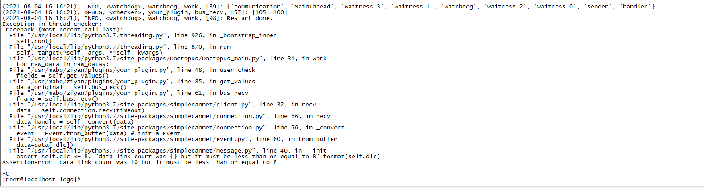

10.7.93.44

- [tv_toc_5m03](https://10.7.0.117:9091/mabo_group/deploy_application/tv_toc_5m03/tree/master)

> name 'NeedMoreDataError' is not defined
> 多次会后重启容器(也不一定会重启).
>
> 重启后, 如果台架开着, 会正常传输
>
> 如果台架没开, 会出现data link count was 10 but it must be less than or equal to 8

```
recv data: b'\xaa\x00\xff\x0012101'
Traceback (most recent call last):
  File "<stdin>", line 4, in <module>
  File "<stdin>", line 5, in convert
  File "<stdin>", line 2, in from_buffer
struct.error: unpack_from requires a buffer of at least 13 bytes
```

存在接收到这样的数据.

这个扩展起来是这样的情况:

```bash
recv data: b'\xaa\x00\xff\x00121011829'
data convert: {'timestamp': 0, 'arbitration_id': 16711729, 'extended_id': True, 'is_remote_frame': False, 'is_error_frame': False, 'dlc': 10, 'data': b'21011829'}
recv data: b'\xaa\x00\xff\x0012101'
unpack_from requires a buffer of at least 13 bytes
recv data: b'1829'
unpack_from requires a buffer of at least 13 bytes
recv data: b'\xaa\x00\xff\x00121011829'
```

**问题1结果:**就是简单的读取到的数据不全. 这里应该报, `NeedMoreDataError`, 但simplecannet这里没有做处理. 这里重新弄一下就好了.


然后就得看这个dlc上的问题了 ,哪有`data link count was 10 but it must be less than or equal to 8`啊..

<!--emmm....??????这算是启动了么?-->

```
recv data: b'\xaa\x00\xff\x00121011829'
{'flags': 170, 'timestamp': 0, 'arbitration_id': 16711729, 'extended_id': True, 'is_remote_frame': False, 'is_error_frame': False, 'dlc': 10, 'data': b'21011829'}
AssertionError: data link count was 10 but it must be less than or equal to 8
```

对于这条, 获取到的dlc长度不对.

flags为170

```
b'\xaa\x00\xff\x00121011829'
```

我怀疑是因为这个原因:

> https://www.kvaser.com/about-can/can-dictionary/
>
> **DLC** – Data Length Code. A part of the CAN message. It used to mean simply the length of the CAN message, in bytes, and so had a value between 0 and 8 inclusive. In the revised CAN standard (from 2003) it can take any value between 0 and 15 inclusive, however the length of the CAN message is still limited to at most 8 bytes. All existing CAN controllers will handle a DLC larger than 8.

程序这里是按照dlc的长度来判别的:

```python
        if dlc is None:
            self.dlc = len(self.data)
        else:
            self.dlc = dlc

        assert self.dlc <= 8, "data link count was {} but it must be less than or equal to 8".format(self.dlc)
```

所以会报错的感觉...

这里应该允许dlc大于8. 但大于8的时候需要检查len(data)不让其大于8.

行吧, 就按照这样的方法改吧.